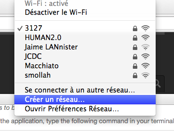
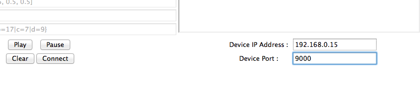

# iPhoneComposer #
==============

iPhone Composer Application for UCSD MUS276C Course and using in UCSD MUS267.

## System Requirements ##
The software has only been tested on Mac OS X. Support on Windows or Linux is not guaranteed.  The following software are assumed to be already installed properly:

 - Python 2.7 or more with setup tools. A good way to install those is to follow the [Python Mac OS X setup guide](http://docs.python-guide.org/en/latest/starting/install/osx/).
 - Latest (or as late as possible) version of [Xcode](https://developer.apple.com/xcode/). Xcode is required because its installation contains all the required audio librairies.
 - touchOSC Editor and Midi Bridge both available [here](http://hexler.net/software/touchosc) (go to the bottom of the page to find them).
 - iOS or Android device with the TouchOSC application installed (you can install touchOSC from the app store, it costs 5$, but can have lots of uses outside the context of this application).
 - [SimpleSynth](http://www.macupdate.com/app/mac/7177/simplesynth)(free) (or any other MIDI synthesizer, such as [NLog PolySynth](http://www.temporubato.com/index.php?page=ProdMAC)(12$)).

The following python modules will be installed by the application (if they don't already exist):

 - python-rtmidi
 - athenaCL
 - music21
 - pyOSC

## Installation instructions

### STEP 1 : Run the setup.sh script

*This step only needs to be done once.*

In the root folder of the application, type the following command in your terminal:
 
 	./setup.sh

This will download and install the appropriate python modules.

### STEP 2 : Start the TouchOSC Bridge application
*This step needs to be done each time your restart your computer.*

Launch the Touch OSC Bridge application. If all goes well, you should see a little *B* icon on the top right corner of your screen like this :

### STEP 3 : Connect to WiFi
*This step needs to be 	done each time your computer and device are not under the same WiFi.*

Make sure your computer and mobile device are both on the same WiFi network. It is generally preferable to have them on a small network for higher chances of mutual detection. Therefore it can be a good idea to create a network from your computer and have your device connect to it:

 

### STEP 4 : Upload the layout file onto your phone
*This step only needs to be done once, and requires wifi.*

Before you can use the iPhone composer, you have to upload the iPhoneComposer.touchosc layout file unto your computer and connect the device to your computer. In order to do so, follow these steps carefully : 

 + Open the layout file with the TouchOSC editor.
 + Open the Touch OSC Bridge application on your computer.
 + Open
 + Once the layout file is open on the TouchOSC application, click on the "Sync" button
 + Back on the device, open the touch OSC application. You should be seing 3 sections : Connections, Layout and Option. This is the Touch OSC Menu.
 + Select MIDI Bridge under Connections. You should be seing your machine under Found Host() if you opened the Touch OSC Bridge app correctly. Select it and copy the IP address under Host.
 + Tap on layout > Add. You should now be seeing two (potentially empty) sections called editor hosts and found hosts. 
   - If you are lucky, the device app detects the TouchOSC editor under Found Hosts() and you just have to select the machine's name from the drop down list. Select it and this will upload the layout onto the device's touchOSC application. 
   - If you are less lucky and your touchOSC editor does not appear under Found Hosts(), tap on the Edit button on the upper right corner, and then on the + on the upper left corner. Now paste the address you copied earlier here. Now you should see the address you pasted under Editor Hosts. Select it and this will upload the layout onto the TouchOSC application on your device.

If you get any trouble at this step, you can also checkout [Hexler.net's guide](http://hexler.net/docs/touchosc-configuration-layout-transfer-wifi).

### STEP 5 : Set up the wifi configuration for the current network on your phone

*This step needs to be done each time your change wifi configuration, and requires wifi.*

 + Go to the Touch OSC Menu.
 + Select MIDI Bridge under Connections. You should be seing your machine under Found Host() if you opened the Touch OSC Bridge app correctly. Select it and copy the IP address under Host.
 + Go back to the Touch OSC Menu and go under OSC. Paste the copied IP address under Host. Make sure that the incoming port is set to 8000 and the out coming port is set to 9000.
 + Finally, you can go back to the iPhoneComposer user interface by taping Done on your device from the TouchOSC Menu.

### Step 6 : Start the python application
*This steps needs to be done each time the application is started.*

Now you can start the application by issuing the following command from the project's main directory:
    
    python src/main.py
 
Once the application is started, the final set up step is to make sure that iPhone Composer is aware of your device (by this time your device should already be aware of your computer, you can make sure of this by tapping any element of the device UI, an output should appear under the OSC window on the iPhone Composer desktop application).

 + Back on the TouchOSC Menu, go under OSC and look at the Local IP Address field. 
 + Type this IP address in the Device IP Address entry on the desktop application, and enter 9000 as the Device Port (it should match with the incoming port of the device). The bottom of your application should look like this: 
 
 + Back on the desktop application, click on Connect. This achieves the linking between the application and the device, and your iPhoneComposer is ready to be used!

### Step 7 : Start and connect the MIDI synthesizer
 *This step is technically optional, but required for sound output.*
 Make sure your MIDI synthesizer uses the `iPhone Composer MIDI output` Midi channel.

### Notes
 
  - The last two tabs (Volume and Markov) are not yet supported. You can still edit markov weights through YAML files.
  - If markov weights are not specifically mentioned on the YAML file, some random weights are generated in order to satisy the system constraints.
  - Weights of 0 cannot be used for markov weights (it would be nice to change that in the future).
  - The save option is not yet supported.
  - The application does not support dynamic port allocation yet, so please clear the 8000 and 9000 ports on your machine in order for the machine to run properly.
 
