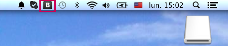

## Preview of next generation iPhoneComposer

### Part 1 : Algorithm generation

### Part 2 : Interface changes

Here is shown the layout of what the new interface would look like on an iPad.

#### Instruments and Presets

#### Path

#### Rhythm

After right phase shift

#### Pitch

#### Amplitude

 
