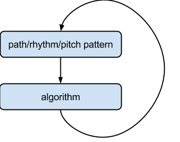
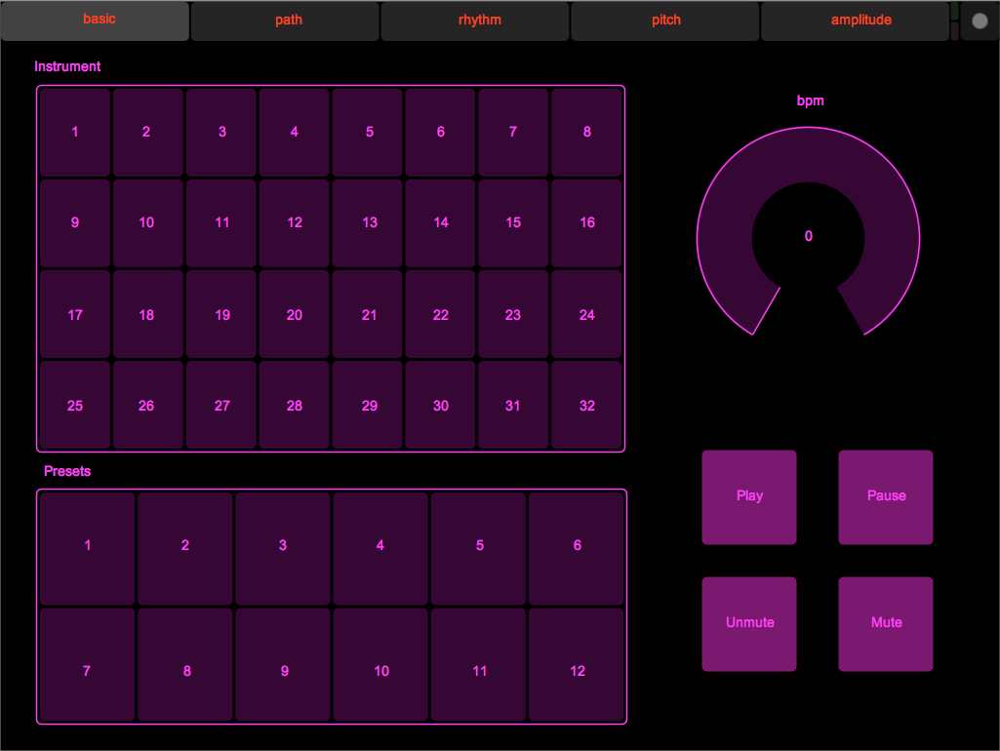
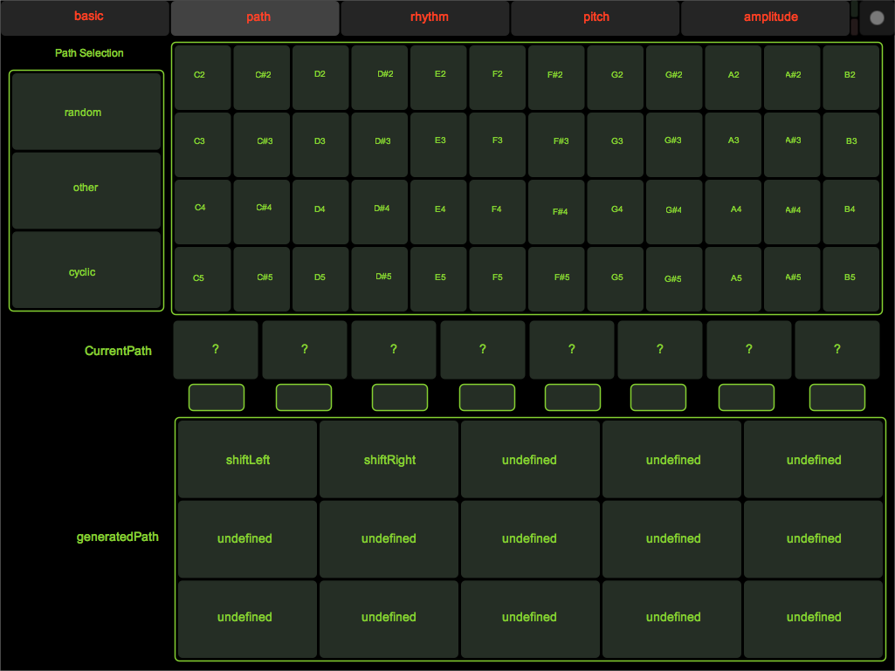
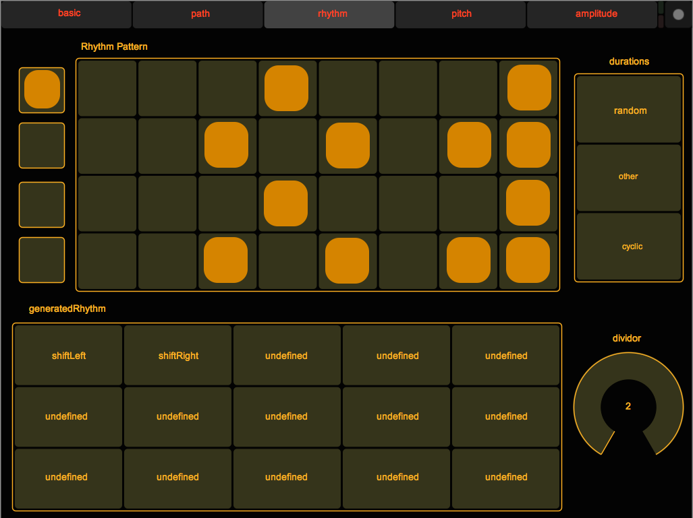
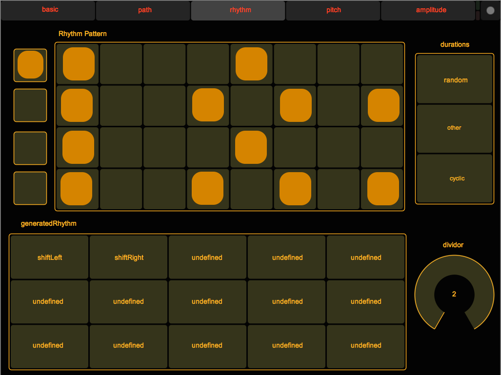
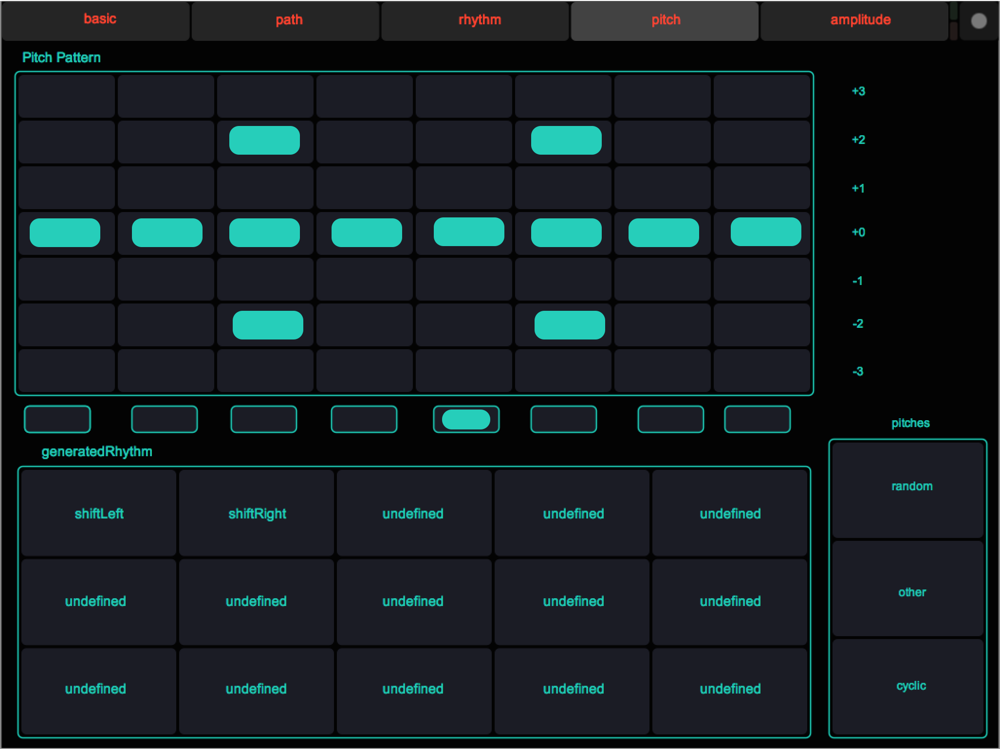
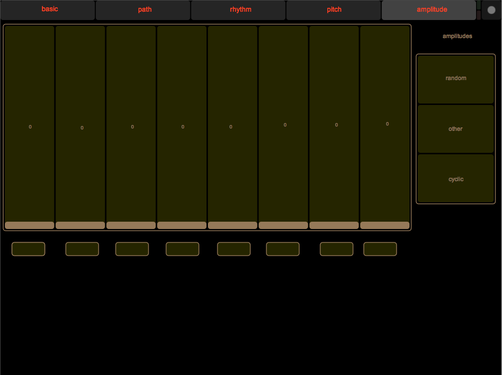

## Preview of next generation iPhoneComposer

### Naming conventions

Some naming conventions used throughout this presentation to identify components of the application are described here. This is a first attempt to "formalize" the design of the application (Note to self: in the future, the notation should be aligned as much as possible with AthenaCL).

- *Note generation* : in iPhoneComposer, the musical composition is created through live MIDI note generation.
- *Musical Features* : in iPhoneComposer, the note generation originates from musical feature configurations. Each musical feature can then be configured independently. There are currenlty 6 controllable musical features used for the note generation:
    - *Path* : describes the notes used, expressed in musical format (i.e. 'C3', 'D#4'...).
    - *Rhythm* : describes the rhythmic patterns used.
    - *Pitch* : describes the pitch modulation patterns used.
    - *Amplitude* : describes the amplitude patterns used.
    - *Instrument* : describes the MIDI instrument used.
    - *BPM* : describes the bpm used.
- *Atom* : smallest element of a musical feature which can be configured. What an atom corresponds to may be different for each musical feature (e.g. a pitch such as 'C3' is an atom for a path, an float such as 0.51 for an amplitude).
- *Pattern* : the set of atoms for a given feature.
- *Pattern Board* : the component of the device user interface with which the user configures the pattern of a given musical feature.
- *Selection Mode* : the selection mode describes the way the next element will be chosen from a pattern for the note generation.
- *Selector* : the component of the device user interface which represents the current selection mode.
- *Tab* : a tab exists on the device user interface for each musical feature and describes the configuration for that feature. Some features, such as BPM and Instrument, are on the same tab (called Basic).

### Part 1 : Algorithm generation

Up to now, the only to provide non-determinism in the iPhoneComposer application was by using choosing a non-cyclic selection mode (such as uniform random). In particular, the pattern configuration happens entirely manually and this reduces greatly the "compositional" aspect of the application. As such we add a new component to the device user interface, the *Algorithm Board*.

The *Algorithm Board* describes algorithms which alter musical feature patterns.

```python
def algorithm(pattern):
	#modify pattern
	return pattern
```

 On any given tab with an algorithm board, tapping an algorithm 



### Part 2 : Interface changes

Here is shown the layout of what the new interface would look like on an iPad.
<!-- 
#### Instruments and Presets
controls which MIDI instrument and the bpm for the composition, as well as preset.



#### Path

- *Position indicator*

#### Rhythm
<!-- 

After right phase shift



#### Pitch


#### Amplitude

 
-->